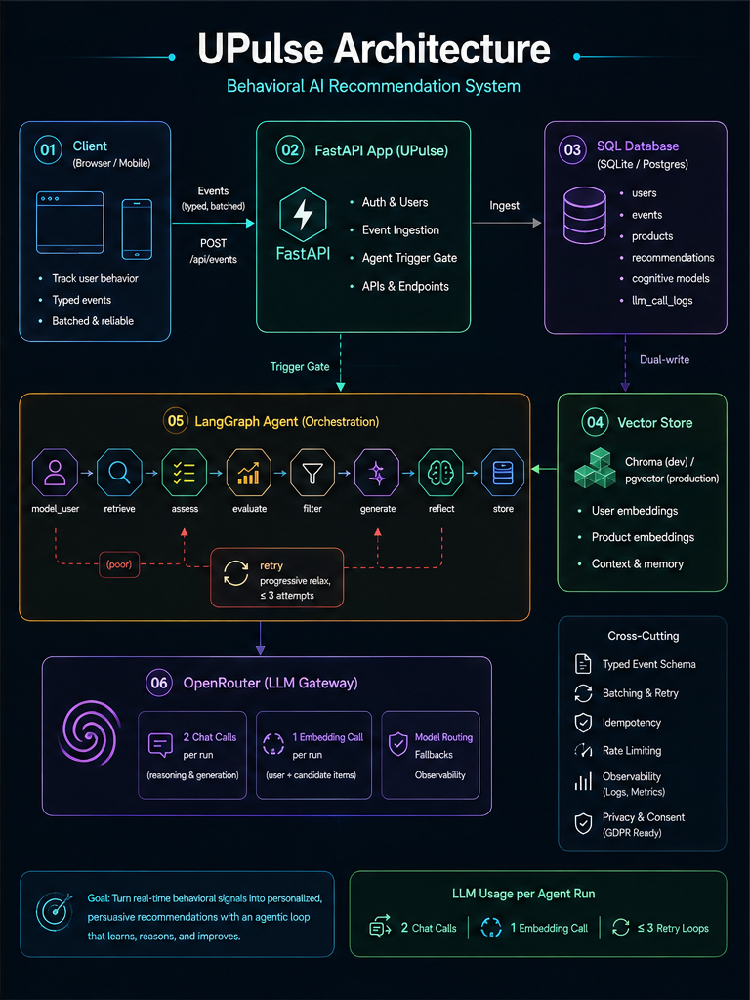
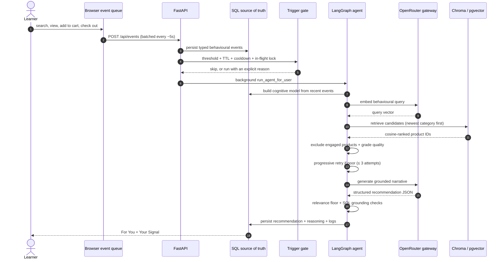

<div align="center">

# UPulse

### Behaviour becomes a recommendation.

UPulse is an explainable behavioural AI recommendation agent that watches how a user
actually behaves, infers intent, retrieves only genuine catalogue courses, and turns
them into grounded, persuasive recommendations without calling an LLM on every event.

[](https://upulse-behavioral-ai.onrender.com/)
[](https://github.com/mansari40/SmartReco-Behavioral-AI-Recommendation-Agent/blob/main/tests)
[](https://www.python.org/)
[](https://fastapi.tiangolo.com/)
[](https://langchain-ai.github.io/langgraph/)
[](https://openrouter.ai/)
[](https://www.trychroma.com/)
[](render.yaml)

[**Explore the architecture**](#architecture) ·
[**Judge-ready live flow**](#judge-ready-live-flow) ·
[**Run locally**](#run-locally) ·
[**Review the tests**](#quality-gates)

<p>If you find my project helpful, please give it a star ⭐ on GitHub!</p>

</div>

## At a glance

| | |
|---|---|
| **Personalisation input** | Page views, product views, searches, clicks, time-on-page, cart adds, checkout starts |
| **Agent** | Bounded LangGraph: model_user → retrieve → assess → evaluate → filter → generate → reflect → store |
| **AI gateway** | OpenRouter for `openai/text-embedding-3-small` and `openrouter/free` chat |
| **Retrieval** | Persistent Chroma cosine search (pgvector in production) over 52 seeded catalogue courses |
| **Grounding** | SQL/vector dual-write, relevance floor, and a retrieved-product engagement exclusion before persistence |
| **Reliability** | Trigger gate, 30-minute TTL, 60-second cooldown, per-user in-flight lock, and honest LLM-call logs |
| **Delivery** | Personalised "For You" page, live signal explanation, admin console, and a scheduled daily digest |

## The story

Most "recommendation agents" in this space are thin wrappers that paste a user's
recent searches into a prompt and ask the LLM to pick courses. That is expensive,
unscalable, and often ungrounded; the LLM can invent courses that don't exist.

UPulse takes a different stance, and every design decision below exists to protect
one or more of these guarantees:

| Invariant | What UPulse enforces |
|---|---|
| **No invented products** | The model sees retrieved candidates only; every persisted product is re-joined to the SQL catalogue. |
| **No AI call on every click** | Event threshold, fresh-recommendation TTL, 60-second cooldown, and a per-user in-flight lock gate every run. |
| **No re-serving engaged courses** | Checked-out, carted, previously recommended, and recently viewed products are excluded on every retrieval attempt. |
| **No empty overwrites** | A 0.20 relevance floor plus a store guard: a run with no valid candidates keeps the previous active recommendation. |
| **No hidden spend** | Exactly 3 AI calls per run (2 chat + 1 embedding), enforced by tests and visible in `llm_call_logs`. |
| **No silent vector drift** | Products are dual-written to SQL and the vector store; retrieval is always grounded in real catalog rows. |
| **No invisible reasoning trail** | Every run records its cognitive model, candidates, scores, alternatives, and narrative in the Agent Console. |

## Judge-ready live flow

The strongest demonstration shows the agent following an **interest shift**: a user
whose behaviour moves from Data Engineering to AI must get an AI recommendation, not
a repeat of their old one:

1. Create/login as a fresh user.
2. Open two or three **Data Engineering** courses, add them to cart, and check out.
3. Open **For You**; a DE-based recommendation appears once the background run completes.
4. Go back to the catalog, open several **AI** courses, add one to cart, and check out.
5. Return to **For You**: the new recommendation reflects the AI interest, and none
   of the checked-out, carted, or previously recommended courses reappear.
6. Check the **Your Signal** panel: the recent AI activity is visible right beside
   the recommendation.

The recommendation can start automatically after the event batch crosses the trigger
threshold; the "For You" page polls the API every 5 seconds, so a temporary
processing delay resolves itself without a manual refresh.

## Architecture

Events flow from the client through FastAPI into SQL and the vector store, where a trigger gate decides when to run the bounded LangGraph agent. Every AI call, exactly three per run, goes through a single OpenRouter gateway.




### Request lifecycle



### The adaptive agent graph

The graph is an explicit state machine with no open-ended tool loop. Every node
reads the shared `AgentState` and returns a partial update; LangGraph merges them.

```text
model_user ─▶ retrieve ─▶ assess ─▶ evaluate ─▶ filter ─▶ generate ─▶ reflect ─▶ store ─▶ END
                                 │
                                 └─▶ retry ─▶ assess   (progressive relaxation, bounded ≤ 3 attempts)
```

| Node | Role |
|------|------|
| `model_user` | Reads up to 50 recent events, asks the LLM to update the user's cognitive model (interests, decision stage, readiness, category affinity, session arc), persists it. |
| `retrieve` | Builds a query from the cognitive model; the user's **newest** category interest leads. Embeds it, runs a metadata-filtered semantic search, and drops products the user has already engaged with. **Dual-write guarantee:** only real catalog rows come back. |
| `assess` | Deterministic retrieval-quality gate: are there enough candidates, and is the best match actually similar? No LLM. |
| `retry` | If retrieval quality is poor *and* a category filter was applied, re-runs the search with the **same embedding** under the next progressive stage (newest category, then all recent categories, then unfiltered), re-applying engagement exclusions. Deterministic, zero extra AI calls, bounded to 3 attempts. |
| `evaluate` | Deterministically scores each candidate against the cognitive model (semantic similarity + category affinity + inferred-intent keyword overlap). No LLM. |
| `filter` | Deterministically keeps candidates that clear the **relevance floor (0.20)**, up to 4. `MIN_RESULTS` is a target, never a forced fill; no valid candidates means an empty recommendation, not invented ones. No LLM. |
| `generate` | LLM writes a persuasive, personalized narrative grounded in the filtered candidates. |
| `reflect` | Deterministic grounding/quality gate; never requests regeneration (so spend stays at exactly 3 AI calls/run). |
| `store` | Persists the recommendation (deactivating any previous active one), records reasoning + alternatives, all grounded in the real catalog. If a run produced no valid candidates, the **previous active recommendation is kept**, never overwritten with an empty one. |

### Why the graph is genuinely adaptive

The `assess` node makes a real, observable decision per run:

- If retrieval quality is **good** (enough candidates, best match is similar), the
  graph flows straight through to `evaluate` - the normal 3-call path.
- If retrieval quality is **poor** and a category filter was narrowing the search,
  the graph routes to `retry`, which advances to the **next progressive filter
  stage** and re-searches with the already-computed embedding (no new embedding
  call, no chat call): attempt 1 restricts to the user's newest category, attempt
  2 broadens to all recent categories, attempt 3 drops the filter entirely as a
  final fallback. Bounded to `MAX_RETRIEVAL_ATTEMPTS = 3` per run, and engagement
  exclusions are re-applied on every attempt.
- If quality is still poor, the run proceeds with the best grounded candidates it
  has rather than failing or inventing products.

The decision uses deterministic signals (candidate count, best cosine similarity)
that are already in state - no extra LLM call is added to "decide."

### Engagement-aware candidate selection (no re-serving what the user already has)

Before evaluation, every retrieval attempt drops products the user has already
engaged with, scoped per user:

- **Checked out** - from `checkout_start` events, read from
  `event_metadata.product_ids` (never guessed from a single `product_id`).
- **Added to cart** - from `add_to_cart` events (all-time).
- **Already recommended** - from prior `recommendations` rows (all-time).
- **Viewed recently** - `product_view` events within the last 24 hours.

Exclusions are applied **after** candidate extraction, on every retrieval attempt
(initial filtered query and each progressive retry), so engaged courses can never
slip back in through the relaxed or unfiltered path. Implemented in
`app/services/engagement_filter.py`.

### Relevance floor and the empty-result contract

`filter` keeps only candidates scoring ≥ `RELEVANCE_FLOOR` (0.20) and never
force-fills below-floor candidates - `MIN_RESULTS` (2) is a target, not a
requirement. If no candidate clears the floor (for example, everything relevant
is already engaged), the run produces **no recommendation**, and `store` keeps
the previous active recommendation intact instead of overwriting it with an
empty one.

### Cost optimization (why it's exactly 3 AI calls per run)

- **2 chat calls** (`model_user` + `generate`) - only the two places that
  genuinely need a model.
- **1 embedding call** (`retrieve`) - reused verbatim across every progressive
  retry stage.
- `evaluate`, `filter`, `reflect`, `store`, and `assess`/`retry` are
  deterministic - **zero** LLM calls.

## Behavioural tracking

The `/api/events` endpoint accepts batched, typed events:

| Type | Weight | Meaning |
|------|--------|---------|
| `page_view` | 0.4 | Navigational interest |
| `product_view` | 1.5 | Real consideration signal |
| `search` | 2.0 | Explicit intent (+0.5 if a query is present) |
| `click` | 1.0 | Engagement |
| `time_spent` | 0.6 | Engagement depth (scaled, capped) |
| `add_to_cart` | 3.0 | High-intent |
| `checkout_start` | 4.0 | Highest intent |

Events are user-isolated, batched, and fed to `model_user`, which converts them
into a structured cognitive model:

- **stated_intents** - what the user explicitly searched for
- **inferred_intents** - deeper interests inferred from behavior
- **decision_stage / purchase_readiness / price_sensitivity**
- **category_affinity** - categories actually engaged with
- **session_arc** - one-sentence narrative of the browsing session

## Dual-write: SQL + vector store

Products exist in **two** places, kept in sync:

1. **SQL** (`products` table) - the source of truth for catalog data (title,
   description, category, price, level, rating).
2. **Vector store** (`course_embeddings` via pgvector, or the Chroma collection
   in dev) - embeddings for semantic search, keyed by the same product
   `vector_id` and carrying `sql_id` for grounding.

Every product create/update writes both; deletes remove both. Retrieval joins
vector hits back to SQL rows, so a recommendation can **never** reference a
product that isn't in the catalog.

## OpenRouter integration

All AI traffic flows through `app/services/llm_client.py`:

- **Chat:** `openrouter/free` by default (configurable). `response_format_json`
  with an in-prompt JSON contract plus defensive parsing.
- **Embeddings:** `openai/text-embedding-3-small` via OpenRouter.
- **Retry policy:** 5xx and network errors retry up to 3 times with exponential
  backoff; **429 is fail-fast** (retrying a quota-exhausted call only amplifies
  cost); 4xx are never retried.
- **Auditability:** every call (success or failure) is written to `llm_call_logs`
  - the Agent Console shows real numbers, never invented ones.

## Recommendation triggering (when does the agent run?)

Running the full pipeline costs 3 AI calls, so the trigger gate is deliberately
conservative. After each event batch it decides whether to run the agent:

- **Count-based cursor:** only events the agent hasn't seen yet count as new,
  selected **deterministically** (newest-first by `created_at`, then `id`, so
  events sharing an identical timestamp can never be mis-selected).
- **Threshold:** at least 3 new events **or** an aggregate weighted score ≥ 3.0.
- **Fresh-recommendation TTL:** if the user received a recommendation within the
  last 30 minutes, the agent skips the run unless the new activity contains a
  high-intent signal (search / add-to-cart / checkout) - this alone removes the
  largest waste class (re-running after light post-recommendation browsing).
- **Cooldown:** no more than one run per user per 60 seconds.
- **In-flight lock:** a per-user `asyncio` guard prevents concurrent runs for the
  same user, so a batch racing the daily digest can never double-run or double-write.

## Scheduled digest

`app/services/scheduler.py` runs a **real** daily digest (APScheduler, 16:00
server time) independent of any HTTP request:

1. Finds users with activity in the last 24 hours.
2. Skips users whose last recommendation is fresh (within the TTL) with no strong
   new signal - the same gate the event trigger uses.
3. Runs the agent for every qualifying user with reason `daily digest (scheduled)`.

The digest is started/stopped with the app lifespan and never blocks the API.

## Technology stack

| Layer | Technology | Responsibility |
|---|---|---|
| Web application | FastAPI + Jinja2 | Server-rendered marketplace, auth, API routes, and admin UI |
| Data model | SQLAlchemy 2.0 (async) + SQLite/WAL | Users, events, products, recommendations, cognitive models, LLM call logs |
| Agent orchestration | LangGraph | Explicit model/retrieve/assess/retry/evaluate/filter/generate/reflect/store state machine |
| AI gateway | OpenRouter via `llm_client` | Embeddings and structured recommendation generation |
| Semantic retrieval | Chroma (dev) / pgvector (prod) | Persistent cosine search over the seeded catalogue |
| Scheduling | APScheduler | Daily digest and bootstrapping |
| Quality | pytest + `smartreco-checks.yml` | 112 offline tests, fully mocked (no API keys, no network) |

## Repository map

```text
.
├── app/
│   ├── agent/
│   │   ├── nodes/               # model_user, retrieve, assess, retry, evaluate,
│   │   │                        # filter, generate, reflect, store
│   │   ├── graph.py             # Compiled LangGraph state machine
│   │   ├── runner.py            # Per-user in-flight lock + agent invocation
│   │   └── state.py             # Shared AgentState schema
│   ├── routers/                 # Auth, pages, products, events, recommendations, admin, console
│   ├── services/
│   │   ├── engagement_filter.py # Per-user engaged-product exclusions
│   │   ├── trigger_service.py   # Threshold / TTL / cooldown gate
│   │   ├── llm_client.py        # Only AI boundary in the application
│   │   ├── vector_store.py      # Chroma / pgvector facade
│   │   └── scheduler.py         # Daily digest
│   ├── templates/               # Marketplace, For You, signal, admin views
│   └── static/                  # UI + non-blocking behavioural event tracker
├── scripts/                     # seed_products.py, dedupe_catalog.py
├── tests/                       # 112 focused offline tests
├── render.yaml                  # Render Blueprint used for deployment
├── requirements.txt
└── requirements-dev.txt
```

## Run locally

### Prerequisites

- Python 3.11+ (3.13 recommended)
- An OpenRouter API key (free tier works)

### Local development (SQLite + Chroma)

```bash
# 1. Clone and enter the repo
cd SmartReco-Behavioral-AI-Recommendation-Agent

# 2. Create a virtualenv and install deps
python -m venv .venv
# Windows:
.venv\Scripts\activate
# macOS/Linux:
source .venv/bin/activate

pip install -r requirements-dev.txt

# 3. Configure environment
cp .env.example .env
#   - set OPENROUTER_API_KEY
#   - set SECRET_KEY to a random string
#   - set ADMIN_EMAIL / ADMIN_PASSWORD (the admin account is bootstrapped at startup)
#   - set MOCK_EMBEDDINGS=false for real semantic retrieval

# 4. Run
uvicorn app.main:app --reload
```

On startup the app idempotently bootstraps: schema → admin user → 52-course
catalog → course embeddings (all via OpenRouter embeddings). Open
`http://localhost:8000`.

### Production (PostgreSQL + pgvector)

`render.yaml` codifies the deployment. The app auto-creates schema, admin,
catalog, and pgvector embeddings on boot. Set these in the Render dashboard:

- `ADMIN_PASSWORD`, `SECRET_KEY`, `OPENROUTER_API_KEY` (never committed)
- `PUBLIC_BASE_URL` is wired automatically to the service URL via `fromService`
  (used to build working password-reset links).

## Environment variables

| Variable | Default | Description |
|----------|---------|-------------|
| `ENVIRONMENT` | `development` | `production` on Render |
| `DATABASE_URL` | `sqlite+aiosqlite:///./upulse.db` | Postgres in production |
| `SECRET_KEY` | dev-only | JWT signing key - set a long random value |
| `ADMIN_EMAIL` | `upulse@admin.com` | Bootstrap admin email |
| `ADMIN_PASSWORD` | *(empty)* | Bootstrap admin password |
| `OPENROUTER_API_KEY` | *(empty)* | LLM gateway key |
| `OPENROUTER_BASE_URL` | `https://openrouter.ai/api/v1` | Gateway base URL |
| `OPENROUTER_MODEL` | `openrouter/free` | Chat model |
| `OPENROUTER_EMBEDDING_MODEL` | `openai/text-embedding-3-small` | Embedding model |
| `OPENROUTER_MAX_TOKENS` | `4096` | Per-request token cap |
| `MOCK_EMBEDDINGS` | `false` | `true` = deterministic fake vectors (offline dev/tests) |
| `SMTP_HOST` / `SMTP_PORT` / `SMTP_USER` / `SMTP_PASSWORD` / `SMTP_FROM` / `SMTP_USE_TLS` | *(empty)* | Password-reset email delivery |
| `PUBLIC_BASE_URL` | `http://localhost:8000` | Public app URL for reset links |
| `CHROMA_PERSIST_DIR` / `CHROMA_COLLECTION` | `./chroma_data` / `products` | Dev vector store (ignored in prod) |
| `LANGCHAIN_TRACING_V2` / `LANGCHAIN_API_KEY` / `LANGCHAIN_PROJECT` | - | Optional LangSmith observability |

## Quality gates

```bash
pytest -q
```

The **112 focused offline tests** run with `MOCK_EMBEDDINGS=true` (no API keys, no
network) and cover:

- every agent node in isolation plus the full compiled graph;
- the trigger gate (cursor, threshold, TTL, cooldown) and the scheduled digest;
- engagement exclusion per signal: checkout metadata `product_ids`, cart,
  previous recommendations, and the 24-hour view window;
- the 0.20 relevance floor and the empty-result store guard;
- progressive retrieval relaxation (newest category → recent categories → unfiltered);
- dual-write correctness (SQL + vector store can never diverge);
- an end-to-end regression of the Data Engineering → AI interest-shift scenario,
  asserting the engaged set never reappears and the new set reflects the newer
  interest.

CI runs the official SmartReco checks via `.github/workflows/smartreco-checks.yml`.

## Deploy on Render

[](https://render.com/deploy?repo=https://github.com/mansari40/SmartReco-Behavioral-AI-Recommendation-Agent)

The supported deployment is the complete service described by `render.yaml`.
Create a Blueprint from the repository, select the main branch, and provide
`OPENROUTER_API_KEY`, `SECRET_KEY`, and `ADMIN_PASSWORD` when Render requests the
unsynchronised secrets. Render provisions a free PostgreSQL database, wires
`PUBLIC_BASE_URL` from the service URL, and probes `/health`.

## Design trade-offs

- **SQLite + local Chroma** keep the build inspectable and container-friendly,
  but require a single writer and persistent storage in durable production;
  PostgreSQL + pgvector are one Blueprint change away.
- **Server-rendered Jinja** reduces client complexity while still supporting a
  polished, responsive marketplace and a non-blocking batched event tracker.
- **In-process scheduling** is appropriate for one container; multiple workers
  should move the digest to a dedicated worker or Celery Beat.
- **Three progressive retrieval attempts** bound weak-retrieval recovery without
  creating an uncontrolled agent loop.
- **A single LLM gateway** keeps spend, latency, and auditability predictable:
  exactly 3 AI calls per run, never more.

---

<div align="center">

<div align="center">
  Made with ❤️ by Mustafa
</div>


[Live app](https://upulse-behavioral-ai.onrender.com/) ·
[Architecture](#architecture) ·
[Report an issue](https://github.com/mansari40/SmartReco-Behavioral-AI-Recommendation-Agent/issues)

</div>